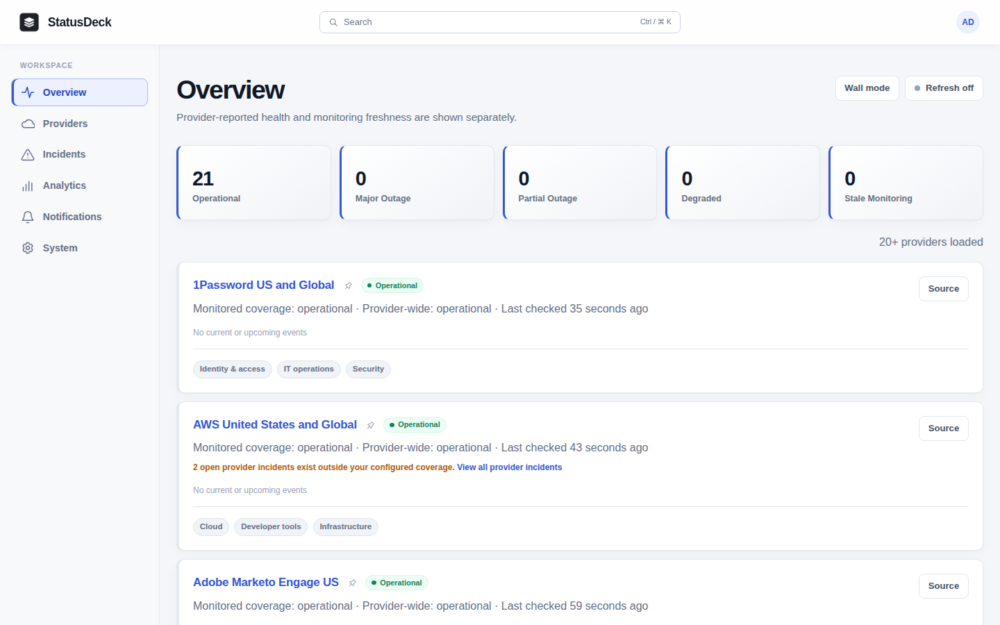

# StatusDeck

StatusDeck is a self-hosted dashboard for provider-published SaaS health. It
tracks providers and components from a curated catalog, retains incident history,
and sends webhook, chat, or Gotify alerts. It does not run synthetic uptime checks.

## How it works

A React frontend reads a Rust API. A separate worker polls official provider
feeds, normalizes their data and dispatches alerts. PostgreSQL stores application
state and durable work queues. Each installation has one local administrator.

Subscriptions control what is monitored; alert rules choose which changes produce
notifications. Provider health and feed freshness are separate: an outdated feed
does not prove that a service is healthy or down. System diagnostics helps explain
collection and delivery problems.

History and reliability reflect the data providers make available. A 365-day
lookback does not guarantee complete coverage, unknown durations remain explicit,
and planned maintenance completion does not confirm recovery.

## Screenshots

[](screenshots/01-overview.png)

[Browse the screenshot gallery](screenshots/README.md) for providers,
incidents, analytics, notifications and system diagnostics.

## Run locally

Create `.env/.env` from [the example](.env/.env.example), replace the placeholder
credentials and keys, and keep the database password consistent with its URL.
Then run from the repository root:

```sh
make dev       # Build and run in the foreground
make docker    # Build and run in the background
```

Both commands use the development Compose stack and serve the built application
at `http://localhost:8080` with the example settings. They apply migrations and
preserve existing database volumes; they do not start Vite hot reload.

For production, configure HTTPS ingress, the public origin, trusted hosts and
secure cookies using [deployment guidance](docs/deployment.md). Back up existing
installations and check schema compatibility before upgrading. Preserve the
channel encryption key with your recovery configuration.

## Documentation

- [Providers](PROVIDERS.md): supported catalog and collection scope.
- [Architecture](docs/architecture.md): system boundaries and data flow.
- [Frontend](docs/frontend.md): browser state and feature concepts.
- [Backend](docs/backend.md): collection, history and notification semantics.
- [Deployment and operations](docs/deployment.md): configuration, development,
  validation, upgrades and recovery.
- [Frontend style guide](frontend/STYLE.md): coding conventions.

## Repository layout

- `frontend/`: React and TypeScript application.
- `backend/`: Rust API, worker, provider catalog and SQL migrations.
- `deploy/`: container builds and Nginx configuration.
- `scripts/`: catalog validation and operational helpers.
