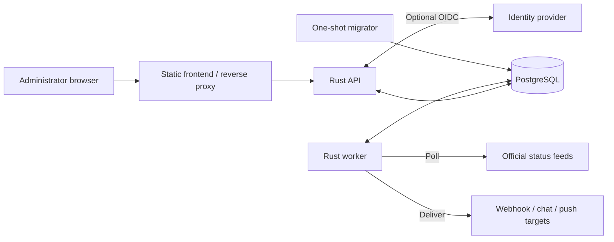

# Architecture

StatusDeck aggregates provider-published SaaS health for one administrator. It
combines component subscriptions, incident history, internal notes, reliability
views and notifications. It reports what providers publish; it does not perform
synthetic checks or measure customer-facing uptime.

The frontend uses React, TypeScript, React Router and TanStack Query with Vite.
The Rust backend uses Axum, Tokio, SQLx and Reqwest. PostgreSQL stores application
state and queued work; Nginx serves the browser application and proxies the API.

## System boundaries

API, worker and migrator are roles of the same backend executable. The browser
reads stored data; collection and delivery continue independently of browser
activity. PostgreSQL also provides leases and durable delivery queues, so there
is no separate broker, cache server or scheduler. The supplied deployment runs
one API and one worker; multi-replica operation is not an established deployment
contract. Production TLS termination belongs to the operator.

## Repository structure

| Location | Responsibility |
| --- | --- |
| [frontend/src/app/](../frontend/src/app/), [features/](../frontend/src/features/) | Session gate, navigation and feature screens |
| [frontend/src/api/](../frontend/src/api/), [hooks/](../frontend/src/hooks/), [components/](../frontend/src/components/), [utils/](../frontend/src/utils/) | HTTP contracts, query cache, reusable UI and formatting |
| [frontend/src/styles/](../frontend/src/styles/), [public/](../frontend/public/) | Theme/styles and bundled branding |
| [backend/src/api/](../backend/src/api/), [auth/](../backend/src/auth/) | HTTP boundaries, account/session handling and OIDC |
| [backend/src/providers/](../backend/src/providers/), [domain.rs](../backend/src/domain.rs) | Compiled catalog, adapters and normalized observations |
| [backend/src/polling/](../backend/src/polling/), [notifications/](../backend/src/notifications/) | Collection, reconciliation, event routing and delivery |
| [backend/src/db/](../backend/src/db/), [migrations/](../backend/migrations/) | Database access and schema |
| [deploy/](../deploy/), [Compose files](../compose_base.yml), [scripts/](../scripts/), [Makefile](../Makefile) | Containers, ingress, local commands and recovery tools |
| [.github/workflows/](../.github/workflows/), [.env/.env.example](../.env/.env.example) | CI and deployment configuration template |
| [docs/](./), [PROVIDERS.md](../PROVIDERS.md), [frontend/STYLE.md](../frontend/STYLE.md) | Subsystem guides, provider coverage and frontend conventions |

There is no root Cargo workspace. Installed dependencies, build outputs and
`graphify-out/` are generated artifacts, not application inputs.

## Main flows and design

1. **Start:** run migrations explicitly, then start API and worker. Both verify
   migration history, bootstrap the single administrator if needed and reconcile
   the compiled catalog. Restarts preserve credentials and subscriptions.
2. **Collect:** the worker polls enabled catalog sources, including unsubscribed
   ones. Adapters convert upstream data into shared snapshots. Reconciliation
   commits observations, incidents and matching notification work together.
3. **Monitor:** subscriptions choose whole providers or explicit components.
   The browser periodically reads dashboard/history APIs; there is no push
   stream. Unsubscribing removes monitored coverage while collection and stored
   history remain.
4. **Notify:** alert rules narrow monitored scope and select channels. A separate
   dispatcher sends committed work, handles quiet-hour summaries and records
   attempts. Retries can duplicate external delivery; receivers should use the
   stable event ID for deduplication.
5. **Investigate:** incident timelines retain provider evidence; bookmarks and
   comments add internal context without changing that evidence or sending alerts.
   Analytics and reliability derive impact from available history.

The code uses direct SQLx queries in feature handlers, provider adapters behind
`StatusProvider`, and database transactions around reconciliation. These observed
patterns keep transport formats separate from domain data and outbound delivery
outside collection transactions; there is no separate architecture-decision log.

## Concepts and trust boundaries

A **source** is a polling unit; a **provider** is a subscribable entry; a
**component** is a service or regional unit within it. Catalog scope determines
what can be collected, monitoring scope what the administrator follows, and
alert scope which changes produce notifications.

Provider health, selected-component health and feed freshness are distinct.
Stale data does not establish current health. Missing history is not zero impact,
and planned maintenance completion does not prove recovery. Reliability describes
reported observations rather than uninterrupted availability.

Password or optional linked OIDC login produces an application session. The
backend enforces authentication and CSRF; browser route gating is only a usability
boundary. There is one administrator and no tenant/role hierarchy, signup or
password-recovery service. Notification secrets and OIDC settings are encrypted
in PostgreSQL. Backups need the corresponding encryption key.

## Where to go next

- [Frontend](frontend.md): routes, state, forms and shared presentation.
- [Backend](backend.md): API families, persistence and processing rules.
- [Deployment](deployment.md): setup, configuration, checks and recovery.
- [Database ERD](database-erd.md): optional table/key reference.
- [Provider catalog](../PROVIDERS.md): supported coverage and source constraints.

These guides describe the checked-in implementation. Source links own exact
fields, thresholds and algorithms; deployment policy gaps are listed in the
[operations guide](deployment.md#maintainer-decisions).
