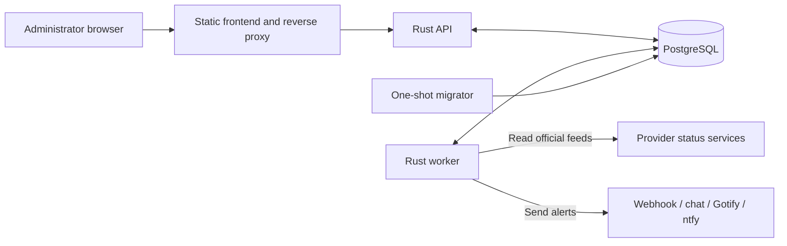
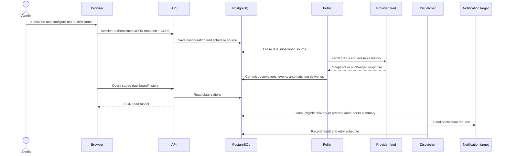

# Architecture

StatusDeck collects provider-published SaaS health for one local administrator.
It tracks subscriptions and component coverage, retains incident history and
sends alerts. It does not run synthetic checks or measure customer-facing uptime.

The browser stack is React 19, TypeScript, React Router and TanStack Query, built
with Vite. The backend is one Rust 2024 crate using Axum, Tokio, SQLx and Reqwest;
the supplied containers use PostgreSQL 18 and Nginx. Dependency versions are
recorded in [Cargo.lock](../backend/Cargo.lock) and
[package-lock.json](../frontend/package-lock.json).

Start with this guide for boundaries and flows, [deployment](deployment.md) to
run the project, and the [frontend](frontend.md) / [backend](backend.md) guides
when changing a subsystem. These describe the current checkout; a running
installation can still contain older code or observations.

## System boundaries

The React frontend reads stored observations through the API. The worker polls
providers and dispatches notifications independently of browser activity.
PostgreSQL holds application state and durable work queues, so no separate
message broker or scheduler is required. Production HTTPS termination is supplied
by the operator.

| Part | Responsibility | Source |
| --- | --- | --- |
| Frontend | Navigation, data presentation and configuration forms | [frontend/src/](../frontend/src/) |
| API | Authentication, configuration, history queries and diagnostics | [backend/src/api/](../backend/src/api/) |
| Provider adapters | Normalize official feeds into shared observations | [backend/src/providers/](../backend/src/providers/) |
| Worker | Poll scheduling, state reconciliation and alert delivery | [polling/](../backend/src/polling/), [notifications/](../backend/src/notifications/) |
| Database | Configuration, observations, history and durable delivery state | [migrations/](../backend/migrations/) |
| Deployment | Containers, proxy configuration and recovery tools | [deploy/](../deploy/), [scripts/](../scripts/) |

## Repository structure and design

| Location | Contents and boundary |
| --- | --- |
| [frontend/src/app/](../frontend/src/app/) | Browser routes, session gate and shared application shell |
| [frontend/src/features/](../frontend/src/features/) | Feature screens and their query/form logic |
| [frontend/src/api/](../frontend/src/api/), [hooks/](../frontend/src/hooks/), [components/](../frontend/src/components/), [utils/](../frontend/src/utils/) | HTTP contracts/cache keys, shared state hooks, presentation and formatting |
| [frontend/src/styles/](../frontend/src/styles/) | Global CSS and theme tokens |
| [frontend/public/](../frontend/public/), [screenshots/](../screenshots/) | Bundled branding/favicon and documentation screenshots |
| [backend/src/](../backend/src/) | CLI startup/configuration, API, authentication, domain types, database access, adapters and worker |
| [backend/src/providers/catalog/](../backend/src/providers/catalog/) | Compiled YAML sources and origin/scope validation |
| [backend/migrations/](../backend/migrations/) | Schema, constraints, indexes, session archive trigger and shared SQL timing functions |
| [deploy/](../deploy/), [compose_base.yml](../compose_base.yml), [compose_dev.yml](../compose_dev.yml), [compose_prod.yml](../compose_prod.yml) | Image builds, reverse proxy and service wiring |
| [scripts/](../scripts/), [Makefile](../Makefile) | Catalog validation, Compose shortcuts, backup/restore and destructive Docker reset |
| [.github/workflows/](../.github/workflows/), [.env/.env.example](../.env/.env.example) | CI and configuration template |
| [docs/](./), [PROVIDERS.md](../PROVIDERS.md), [frontend/STYLE.md](../frontend/STYLE.md) | Subsystem guides, catalog coverage and frontend conventions |

There is no root Cargo workspace, separate queue service or infrastructure-as-code
for a cloud host. Build output (`backend/target/`, `frontend/dist/`), installed
dependencies and `graphify-out/` are ignored generated artifacts. There are no
Rust or frontend test suites. See
[validation](deployment.md#local-development-and-checks).

The following patterns are visible in the code; their benefits are architectural
interpretations, not claims of a separate design-decision record:

- **One backend, separate process roles:** [lib.rs](../backend/src/lib.rs)
  assembles API and worker from shared modules. Handlers execute parameterized
  SQL directly; there is no controller/service/repository layer for every feature.
- **Adapter boundary:** `StatusProvider` converts different upstream formats into
  `ProviderSnapshot`. Polling consumes the normalized domain rather than each
  provider's transport format.
- **Transactional event queue:** observations and matching notification work
  commit together. Delivery happens afterward, preventing outbound HTTP from
  holding the reconciliation transaction open.
- **Read models:** current-status tables support the dashboard; incident history
  and SQL timing rules support analysis. These are persisted observations, not
  an event-sourced reconstruction or an independent distributed cache.
- **Server-owned configuration:** browser query caches are disposable. PostgreSQL
  owns account preferences, subscriptions, rules and history; the compiled
  catalog owns permitted provider origins.

## Scope and health

Three scopes determine what the installation collects and reports:

1. **Catalog:** reviewed provider origins and component coverage define available
   data sources. Catalog changes require a rebuild.
2. **Monitoring:** subscriptions select whole providers or specific components.
   Only sources with enabled subscriptions are polled.
3. **Alerts:** rules narrow monitored coverage and choose events, destinations
   and quiet hours.

A provider is a subscribable catalog entry; a source is its polling unit. Their
identities are distinct, and components belong to providers. Adapters preserve
original provider classifications alongside normalized status and lifecycle.

Provider health and feed freshness are independent. A stale feed retains its
last reported status without proving that status is still current. Provider-wide
health can also differ from the health of selected components.

## Collection and delivery

Startup checks migration state, bootstraps the administrator when needed and
reconciles the compiled catalog. Migrations run explicitly before application
startup. Existing credentials and subscriptions survive restarts.

Subscribing schedules a source for collection. Current status and hourly history
refreshes use independent schedules and retry state, while a shared source lease
serializes reconciliation. The worker reconciles observations, incidents and
matching alert work in a database transaction. Semantic deduplication suppresses
repeated observations; lifecycle generations distinguish reopened incidents.

Deliveries remain durable until processed. Leases coordinate work and allow
recovery after interrupted processing. Quiet hours hold eligible events for a
summary, and transient failures are retried. External delivery is not exactly
once: receivers should deduplicate by event ID.

Removing a subscription stops collection when its source is no longer needed,
while retaining history. Editing an alert rule does not replay past events.
Detailed reconciliation and delivery semantics belong in [backend](backend.md).

The diagram shows a changed snapshot; unchanged responses update source freshness
without generating events. There is no WebSocket or server-sent-event stream.

## History and analysis

Current status and historical evidence serve different purposes. Incident
history records what providers reported, while Analytics and Reliability derive
impact from available timing. Unknown durations and incomplete history remain
explicit; a healthy observed day is not proof of uninterrupted uptime.

Planned maintenance is separate from actual impact. An elapsed planned window
does not establish recovery. Comments and bookmarks are internal account records
and do not change provider data or generate alerts.

## Security and operations

The API uses session authentication and CSRF protection. Channel secrets are
encrypted at rest, provider origins come from the reviewed catalog, and outbound
destinations are validated. The supported deployment model is one API and worker
with PostgreSQL; horizontal scaling is not an established operating model.

Application authentication protects API data, not static assets. Nginx serves the
frontend and branding before sign-in; the worker alone contacts provider feeds
and notification destinations. There is no inbound provider webhook receiver.

Logs, source observations, worker heartbeats and delivery attempts provide
operational evidence. Backups must preserve both the database and the encryption
key needed to recover channel configuration.

## Documentation

- [Frontend](frontend.md): browser state and feature concepts.
- [Backend](backend.md): collection, persistence and delivery semantics.
- [Database ERD](database-erd.md): tables, keys and relational structure.
- [Deployment](deployment.md): configuration, commands and recovery.
- [Providers](../PROVIDERS.md): supported catalog coverage.
- [Style guide](../frontend/STYLE.md): frontend coding conventions.

Keep implementation details in the linked source. Guides should explain concepts,
important behavior and operational requirements rather than mirror every UI or
code change.
