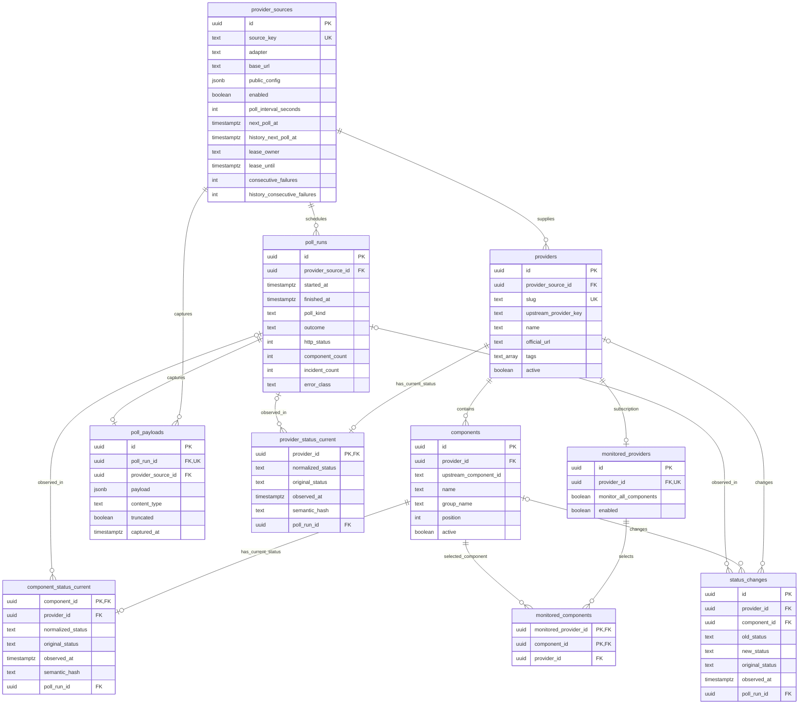
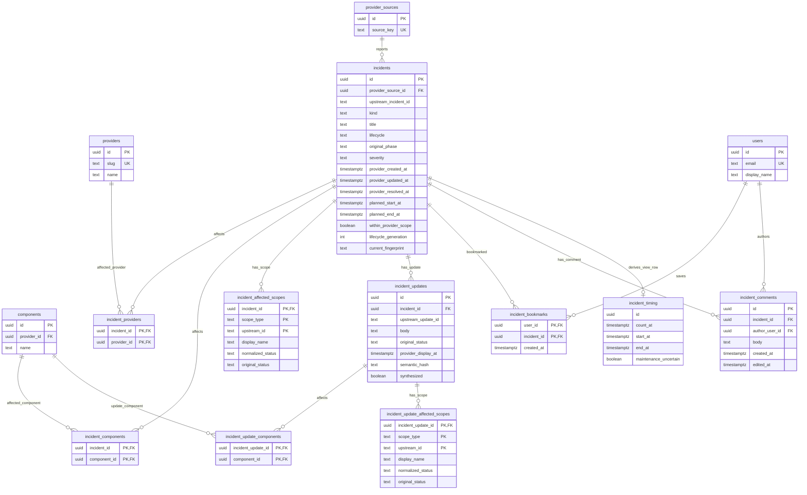
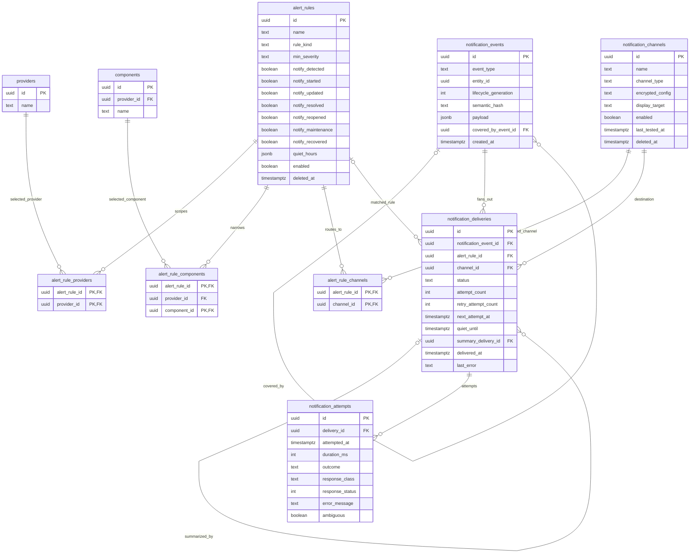
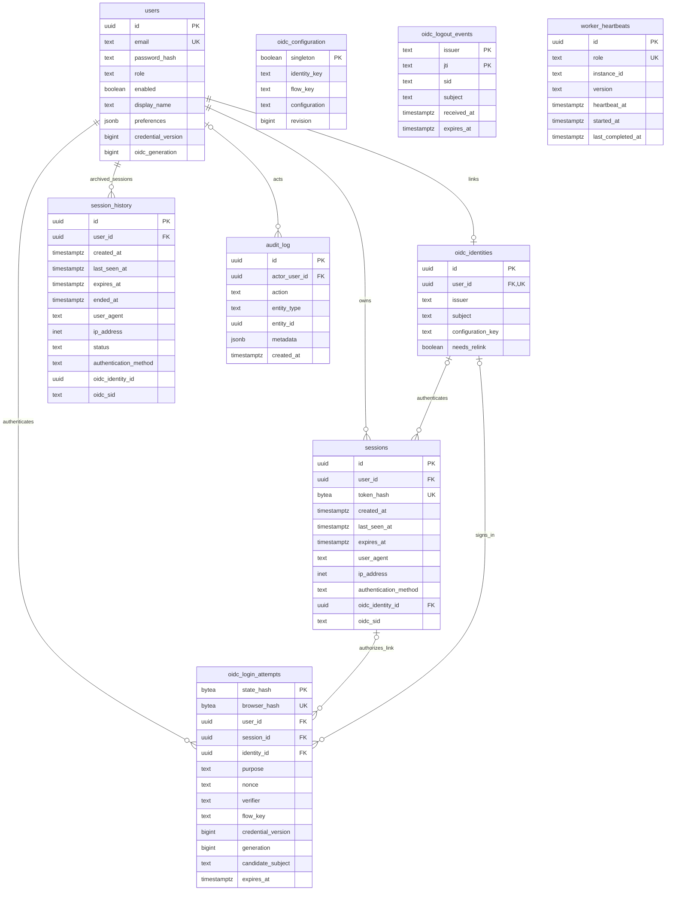

# Database entity-relationship diagram

This document reflects the repository's PostgreSQL schema in
[`0001_initial.sql`](../backend/migrations/0001_initial.sql). It describes the
source schema, not the state of any deployed database. It excludes SQLx's internal
`_sqlx_migrations` table. `incident_timing` is a derived view, not a stored table.

The diagrams show every application table and foreign-key relationship. Columns
are limited to keys and fields that explain each entity's role; JSON payload,
lease, audit and timestamp details remain authoritative in the migration.

## Provider collection and monitoring

`component_status_current` and `monitored_components` also use composite foreign
keys `(component_id, provider_id) -> components(id, provider_id)` to prevent a
component from being paired with the wrong provider.

## Incidents and account annotations

Incident identity is unique by `(provider_source_id, upstream_incident_id)`.
Update identity is unique by `(incident_id, upstream_update_id)` when an upstream
ID exists.

## Alerts and notification delivery

`notification_events.entity_id` is intentionally polymorphic and has no foreign
key. Test deliveries may have no `alert_rule_id`. Event coverage and quiet-hours
summaries create the two self-references shown above.

## Accounts and operations

`audit_log.entity_type` and `entity_id` form an intentionally polymorphic audit
reference. `worker_heartbeats` is independent and keeps one current row per worker
role.

`oidc_configuration` is a singleton with encrypted settings. Its identity/flow
fingerprints are checked by the application, not foreign keys. The issuer/subject
pair is unique in `oidc_identities`; issuer/token ID is the composite logout-event
key. Logout events are temporary replay/revocation markers. Archived OIDC identity
IDs in `session_history` intentionally have no foreign key.

## Deletion behavior

- Rule, monitor, bookmark, session and scope join rows generally cascade with
  their owning record.
- Provider, component, incident, delivery and attempt history generally uses
  `RESTRICT` to prevent accidental loss of evidence.
- Deleting a user sets `audit_log.actor_user_id` to null but retains the audit
  entry.
- Application-level deletion is often soft deletion via `deleted_at`; referential
  actions describe physical deletion only.
