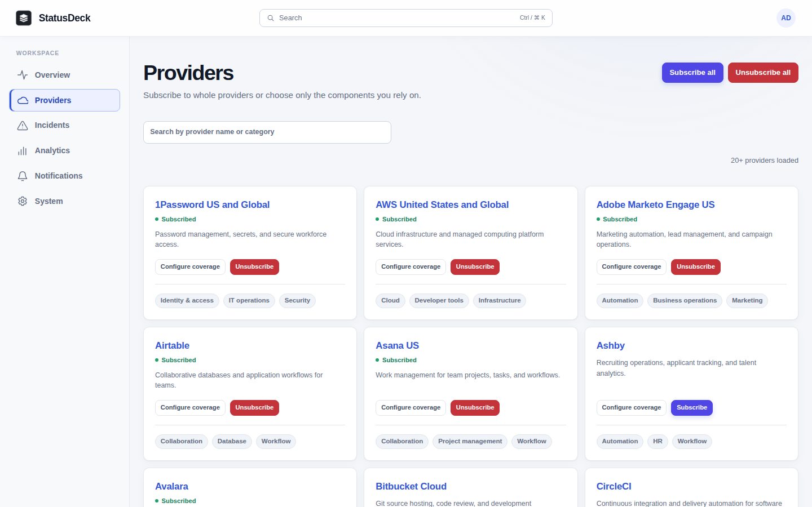
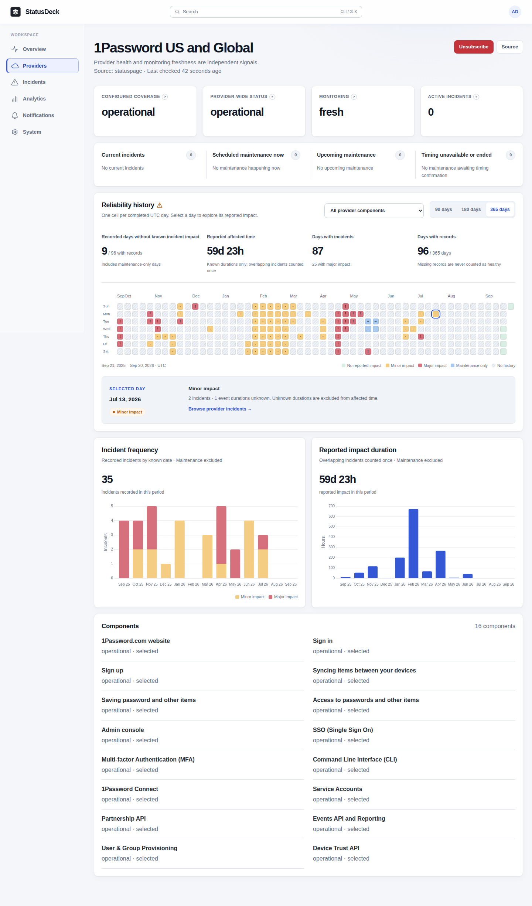
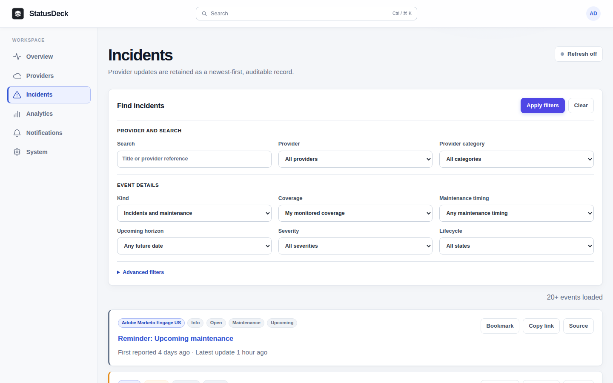
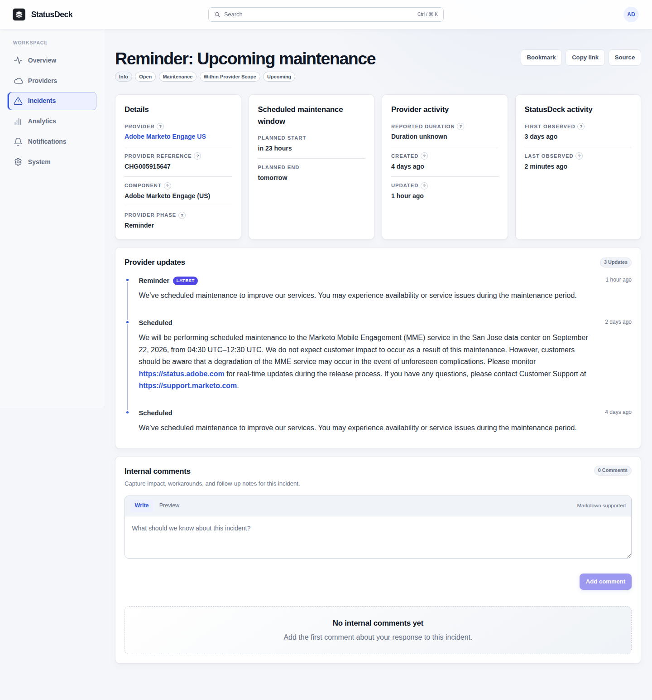
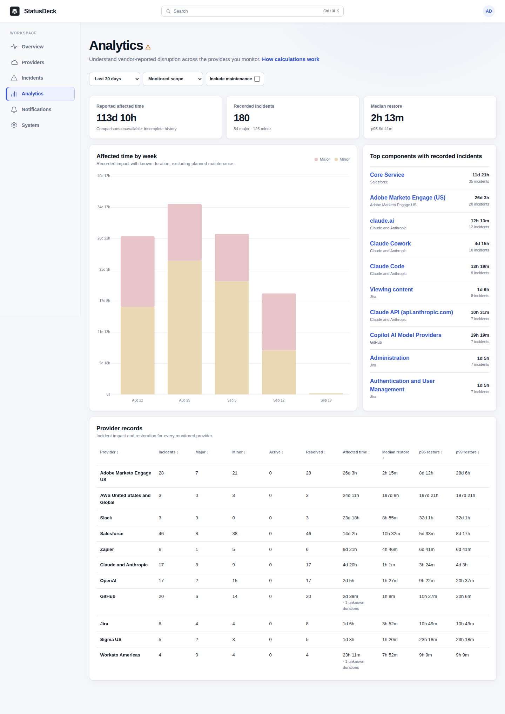
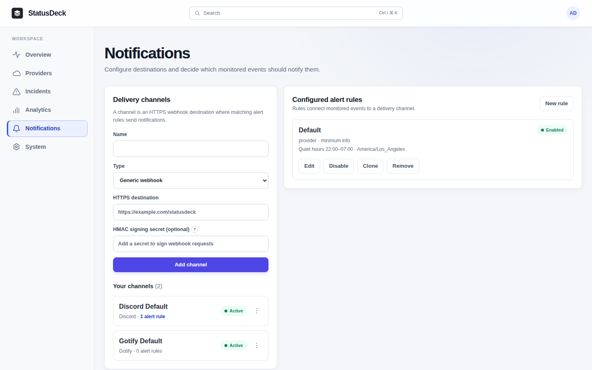
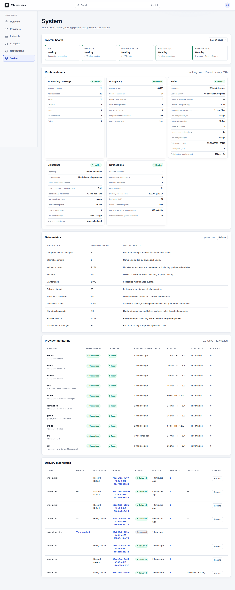
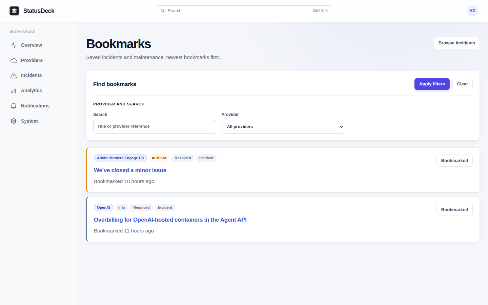
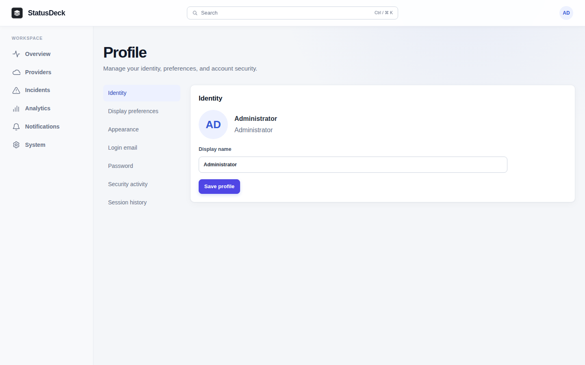

# StatusDeck screenshots

## Overview

## Providers

## Provider details

## Incidents

## Incident details

## Analytics

## Notifications

## System diagnostics

## Bookmarks

## Profile

